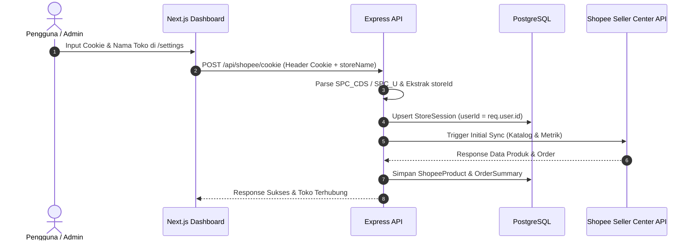

# 📘 Panduan Lengkap & Walkthrough Proyek (Project Handover Document)
**Shopee Marketplace & Warehouse Analytics Dashboard**

> Dokumen ini dirancang sebagai panduan komprehensif bagi developer atau AI agent berikutnya untuk memahami arsitektur, struktur kode, sistem keamanan, multi-tenancy, dan alur kerja aplikasi ini secara mendalam.

---

## 📑 Daftar Isi
1. [Ringkasan Proyek & Tech Stack](#1-ringkasan-proyek--tech-stack)
2. [Sistem Peran (RBAC) & Multi-Tenancy](#2-sistem-peran-rbac--multi-tenancy)
3. [Arsitektur Backend (Express.js + Prisma)](#3-arsitektur-backend-expressjs--prisma)
4. [Arsitektur Frontend (Next.js App Router)](#4-arsitektur-frontend-nextjs-app-router)
5. [Alur Integrasi Shopee & Sinkronisasi Data](#5-alur-integrasi-shopee--sinkronisasi-data)
6. [Struktur Folder & File Kunci](#6-struktur-folder--file-kunci)
7. [Daftar Endpoint API Utama](#7-daftar-endpoint-api-utama)
8. [Panduan Menjalankan, Menguji, dan Build](#8-panduan-menjalankan-menguji-dan-build)
9. [Catatan Penting untuk Pengembangan Selanjutnya](#9-catatan-penting-untuk-pengembangan-selanjutnya)

---

## 1. Ringkasan Proyek & Tech Stack

Aplikasi ini adalah dashboard analitik internal untuk e-commerce (Shopee) dan manajemen gudang (*warehouse*). Aplikasi memungkinkan pengguna untuk menghubungkan toko Shopee mereka, menganalisis performa penjualan, iklan (*Shopee Ads*), katalog produk, rekonsiliasi stok gudang, dan mendapatkan rekomendasi optimasi berbasis AI.

### Teknologi yang Digunakan:
- **Frontend**:
  - Next.js 14 (App Router)
  - React 18 & Vanilla CSS / Modern Glassmorphism Design System
  - Lucide React (Icons)
  - Context API (`AuthContext` & `StoreContext`)
- **Backend**:
  - Node.js & Express.js
  - Prisma ORM (Client 5.x)
  - PostgreSQL (Neon Serverless / Cloud Postgres)
  - JSON Web Token (`jsonwebtoken`) & `bcryptjs`
  - Node-Cron untuk background task sinkronisasi otomatis
- **Integrasi Eksternal**:
  - Shopee Seller Center API (menggunakan Cookie Sesi & CSRF Token)
  - PDC Gudang / Warehouse API

---

## 2. Sistem Peran (RBAC) & Multi-Tenancy

Sistem otorisasi menerapkan **Sistem Peran Biner (Binary Roles)** yang ketat dan **Isolasi Kepemilikan Toko (*Multi-Tenant Isolation*)**:

### Matriks Peran:
| Fitur / Hak Akses | Peran `USER` (Pengguna Biasa) | Peran `ADMIN` (Administrator) |
| :--- | :--- | :--- |
| **Pendaftaran Toko** | Dapat menghubungkan & menghapus toko miliknya | Dapat mengelola toko miliknya dan toko semua user |
| **Visibilitas Toko** | **HANYA** melihat toko yang didaftarkan akunnya (`userId === user.id`) | Melihat **SEMUA** toko dari seluruh user di sistem |
| **Katalog, Iklan & Analitik** | Terisolasi per toko yang dipilih | Terisolasi per toko yang dipilih (bisa pilih toko siapa saja) |
| **Panel Admin (`/admin`)** | ❌ **Dilarang (HTTP 403 Forbidden)** | ✅ **Akses Penuh** |
| **Manajemen Pengguna** | ❌ Tidak ada akses | ✅ Tambah, ubah peran, reset password, hapus user |
| **Kode Registrasi / Undangan** | ❌ Tidak ada akses | ✅ Buat kode, atur kuota/masa berlaku, toggle, hapus |
| **Audit Logs & Keamanan** | ❌ Tidak ada akses | ✅ Pantau log aktivitas administratif sensitif |

### Alur Isolasi Kepemilikan (*Tenancy Guard*):
Setiap request yang membutuhkan data toko melewati middleware guard:
```javascript
// Lokasi: backend/src/controllers/shopeeController.js -> resolveAuthorizedStoreId
async function resolveAuthorizedStoreId(req, requestedStoreId = null) {
  const user = req.user;
  // 1. Jika requestedStoreId diberikan, cari sesi toko di database
  // 2. Jika user adalah USER (bukan ADMIN) dan session.userId !== user.id -> Return 403 Forbidden
  // 3. Jika user adalah ADMIN -> Izinkan akses ke toko mana pun
  // 4. Jika storeId null -> Ambil toko default/aktif milik user tersebut
}
```

---

## 3. Arsitektur Backend (Express.js + Prisma)

### Database Models (`backend/prisma/schema.prisma`):
- `User`: Akun pengguna (`id`, `email`, `password`, `name`, `role` ['ADMIN' / 'USER'], `stores`).
- `StoreSession`: Sesi toko Shopee (`storeId`, `storeName`, `userId`, `cookieString`, `csrfToken`, `isActive`, `lastSyncedAt`). Relasi `user User? @relation(fields: [userId], references: [id], onDelete: Cascade)`.
- `ShopeeProduct` & `ShopeeListingVariation`: Data produk dan variasi per listing Shopee per `storeId`.
- `ShopeeOrderSummary`: Ringkasan GMV, pesanan, dan metrik konversi harian per `storeId`.
- `ShopeeAdsData` & `ShopeeAdsCampaignSnapshot`: Metrik performa iklan harian dan kampanye per `storeId`.
- `WarehouseItem` & `WarehouseStockSnapshot`: Data inventori stok gudang.
- `ProductMapping` & `ProductMappingComponent`: Pemetaan SKU listing Shopee ke SKU komponen fisik gudang.
- `StockReconciliation`: Hasil perbandingan selisih stok Shopee vs Gudang.
- `RegistrationCode`: Kode undangan pendaftaran dengan kuota penggunaan (`maxUses`), `usedCount`, `expiresAt`, dan peran yang diberikan (`role`).
- `AdminAuditLog`: Riwayat pencatatan aktivitas administratif (`USER_CREATED`, `ROLE_CHANGED`, `PASSWORD_RESET`, `USER_DELETED`, dll).

### Proteksi Keamanan Backend:
1. `authMiddleware`: Memverifikasi JWT Bearer Token pada header Authorization.
2. `requireAdmin`: Memastikan `req.user.role === 'ADMIN'`. Jika bukan, mengirim respon `403 Forbidden`.
3. `Anti-Lockout Protection`: Mencegah admin menghapus dirinya sendiri atau menghapus akun Administrator terakhir di sistem.

---

## 4. Arsitektur Frontend (Next.js App Router)

### State Management & Contexts:
1. **`AuthContext.jsx`**:
   - Menyimpan data `user` yang sedang login, token JWT, peran (`role`), serta fungsi `login`, `register`, dan `logout`.
   - Mengarahkan pengguna yang belum login ke `/login`.
2. **`StoreContext.jsx`**:
   - Mengambil daftar toko yang dapat diakses oleh user saat ini via `fetchStores()`.
   - Menyimpan `selectedStoreId` aktif di `localStorage`.
   - Menyediakan fungsi `setSelectedStoreId`, `toggleStoreStatus`, `deleteStore`, dan `syncCurrentStore`.
   - Otomatis memperbarui data di seluruh halaman saat user mengganti toko di Navbar.

### Struktur Rute Halaman:
- `/` : Dashboard Ringkasan (GMV, Pesanan, Grafik Penjualan, Sumber Trafik).
- `/shopee` : Katalog Produk Shopee, pencarian, stok, dan harga.
- `/shopee/performance` : Metrik analitik performa produk secara mendalam.
- `/ads` : Dashboard Performa Iklan Shopee Ads (Spend, ROAS, Penjualan Iklan, CTR, CR).
- `/warehouse` : Data Inventori Gudang, mutasi stok, dan rekonsiliasi.
- `/optimization` / `/growth` : Rekomendasi optimasi listing, toko, dan AI Growth Simulator.
- `/settings` : Pengaturan toko Shopee (Hubungkan toko via Cookie, daftar toko milik user, toggle aktif, sync manual, hapus toko).
- `/admin` : **Panel Administrator** (Khusus `ADMIN`):
  - Tab 1: Manajemen Pengguna & Peran.
  - Tab 2: Generator & Manajemen Kode Registrasi.
  - Tab 3: Manajemen Seluruh Toko Pengguna (Global Store List).
  - Tab 4: Matriks Hak Akses & Status Keamanan.
  - Tab 5: Log Audit Aktivitas Admin.
- `/login` : Autentikasi (Masuk & Daftar dengan Kode Undangan).

---

## 5. Alur Integrasi Shopee & Sinkronisasi Data



Sinkronisasi berkala dijalankan secara otomatis oleh `syncService.js` melalui cron job, yang melakukan iterasi hanya pada toko-toko yang memiliki status `isActive: true`.

---

## 6. Struktur Folder & File Kunci

```
UI/
├── backend/
│   ├── prisma/
│   │   └── schema.prisma          # Skema database relasional PostgreSQL
│   ├── src/
│   │   ├── controllers/
│   │   │   ├── adminController.js     # Logika Panel Admin (User, Code, Stores, Audit)
│   │   │   ├── authController.js      # Login, Register via Code, Profile
│   │   │   ├── dashboardController.js # Aggregasi metrik dashboard overview
│   │   │   ├── shopeeController.js    # Multi-store isolation, cookie, katalog, ads
│   │   │   ├── syncController.js      # Manual & automated trigger sync
│   │   │   └── warehouseController.js # Data PDC gudang & rekonsiliasi
│   │   ├── middleware/
│   │   │   └── authMiddleware.js      # JWT Auth & requireAdmin role guard
│   │   ├── routes/
│   │   │   ├── adminRoutes.js         # Endpoint /api/admin
│   │   │   ├── authRoutes.js          # Endpoint /api/auth
│   │   │   ├── shopeeRoutes.js        # Endpoint /api/shopee
│   │   │   └── ...
│   │   └── services/
│   │       ├── shopeeService.js       # Komunikasi HTTP Shopee, multi-session resolver
│   │       ├── syncService.js         # Loop sync multi-toko & rate limiting
│   │       └── snapshotService.js     # Caching snapshot data analitik
│   ├── server.js                  # Entry point Express backend
│   └── package.json
│
├── frontend/
│   ├── app/
│   │   ├── admin/page.jsx         # UI Dashboard Panel Admin (5 Tab)
│   │   ├── settings/page.jsx      # Manajemen Koneksi Toko Pengguna
│   │   ├── login/page.jsx         # Halaman Login & Registrasi
│   │   ├── page.jsx               # Dashboard Utama
│   │   ├── shopee/page.jsx        # Katalog Shopee
│   │   ├── ads/page.jsx           # Analitik Iklan
│   │   └── AppShell.jsx           # Root layout dengan AuthProvider & StoreProvider
│   ├── components/
│   │   ├── Navbar.jsx             # Store Switcher & User Profile Menu
│   │   └── Sidebar.jsx            # Navigasi Menu Dinamis Berdasarkan Role
│   ├── context/
│   │   ├── AuthContext.jsx        # Global Auth State
│   │   └── StoreContext.jsx       # Global Store Switcher State
│   ├── lib/
│   │   └── api.js                 # HTTP Client Axios/Fetch ke Backend
│   └── package.json
└── PROJECT_WALKTHROUGH.md         # Dokumen ini
```

---

## 7. Daftar Endpoint API Utama

### 🔐 Otentikasi & Akun (`/api/auth`)
- `POST /api/auth/login` : Login user (email + password).
- `POST /api/auth/register` : Pendaftaran akun baru (memerlukan `registrationCode`).
- `GET /api/auth/me` : Mendapatkan profil pengguna yang sedang login.

### 🛍️ Shopee & Multi-Store (`/api/shopee`)
- `GET /api/shopee/stores` : Mengambil daftar toko milik user saat ini (atau semua toko jika admin).
- `POST /api/shopee/cookie` : Menghubungkan atau memperbarui toko dengan cookie baru.
- `POST /api/shopee/stores/active` : Mengubah status aktif/non-aktif toko (`{ storeId, isActive }`).
- `DELETE /api/shopee/stores/:storeId` : Menghapus sesi toko.
- `GET /api/shopee/metrics` : Mendapatkan katalog produk Shopee (menerima `?store_id=`).
- `GET /api/shopee/ads` : Mendapatkan data iklan Shopee Ads (menerima `?store_id=`).
- `POST /api/shopee/sync` : Memicu sinkronisasi manual untuk toko tertentu.

### 👑 Administrator (`/api/admin`) *(Memerlukan Role ADMIN)*
- `GET /api/admin/users` : Mendapatkan daftar semua user terdaftar dengan pagination & search.
- `POST /api/admin/users` : Menambahkan user baru langsung oleh admin.
- `PUT /api/admin/users/:id/role` : Mengubah peran user (`ADMIN` / `USER`).
- `PUT /api/admin/users/:id/reset-password` : Reset password user.
- `DELETE /api/admin/users/:id` : Menghapus user (dilindungi anti-lockout & anti-self-delete).
- `GET /api/admin/stores` : Melihat seluruh toko dari semua pengguna di sistem.
- `GET /api/admin/registration-codes` : Daftar kode registrasi aktif.
- `POST /api/admin/registration-codes` : Membuat kode registrasi baru (kuota & expired).
- `PATCH /api/admin/registration-codes/:id/toggle` : Mengaktifkan/menonaktifkan kode registrasi.
- `DELETE /api/admin/registration-codes/:id` : Menghapus kode registrasi.
- `GET /api/admin/audit-logs` : Log riwayat aktivitas administratif.
- `GET /api/admin/system-stats` : Status kesehatan sistem, DB, dan jumlah data.

---

## 8. Panduan Menjalankan, Menguji, dan Build

### Menjalankan Backend:
```bash
cd backend
npm install
npm run prisma:generate
npm run dev
# Backend berjalan di http://localhost:5000 (atau port yang disetel di .env)
```

### Menjalankan Frontend:
```bash
cd frontend
npm install
npm run dev
# Frontend berjalan di http://localhost:3000
```

### Memvalidasi & Build Frontend:
```bash
cd frontend
npm run build
# Memastikan 0 error dan 0 warning pada TypeScript/Linting
```

---

## 9. Catatan Penting untuk Pengembangan Selanjutnya

1. **Selalu Gunakan `resolveAuthorizedStoreId`**:
   Saat menambahkan endpoint baru yang berhubungan dengan data toko (`ShopeeProduct`, `ShopeeAdsData`, `OrderSummary`), selalu panggil `resolveAuthorizedStoreId(req, storeId)` untuk mencegah kebocoran data antar user (*cross-tenant data leak*).
2. **Pertahankan Sistem 2 Peran**:
   Sistem telah distandarisasi hanya menggunakan `ADMIN` dan `USER`. Hindari menambahkan peran lama seperti `ANALYST` atau `MANAGER` tanpa persetujuan eksplisit.
3. **Pendaftaran Closed-Loop**:
   Pendaftaran akun baru di frontend mewajibkan kode registrasi yang digenerate oleh Administrator melalui Panel Admin (`/admin`).
4. **Keamanan Kredensial Cookie**:
   Field `cookieString` dan `csrfToken` tidak pernah dikembalikan ke client biasa; helper `toPublicSession()` menyaring data sensitif menjadi flag boolean `cookieConfigured: true/false`.

---
*Dokumen ini diperbarui secara otomatis pada tanggal 7 Agustus 2026.*
